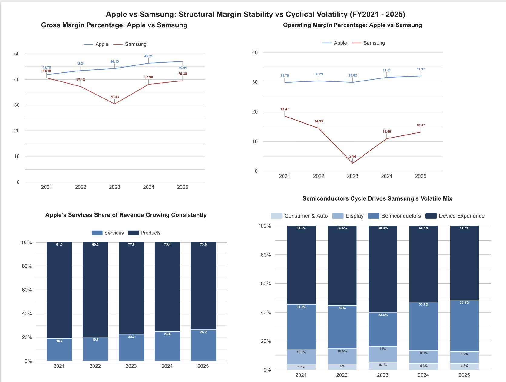
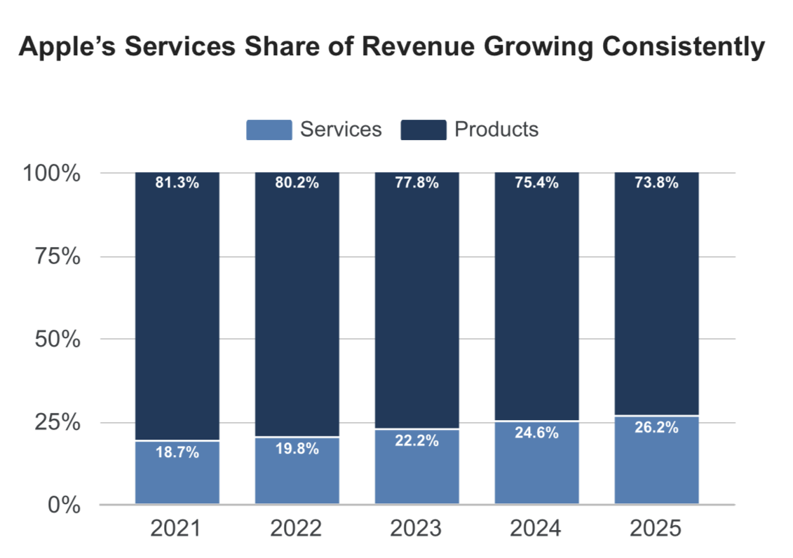
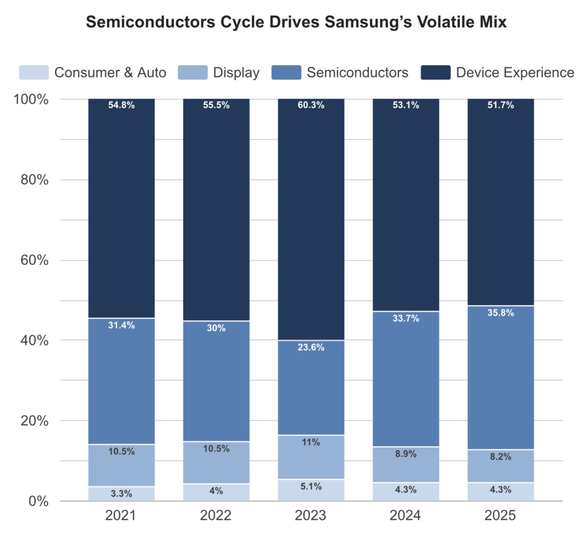
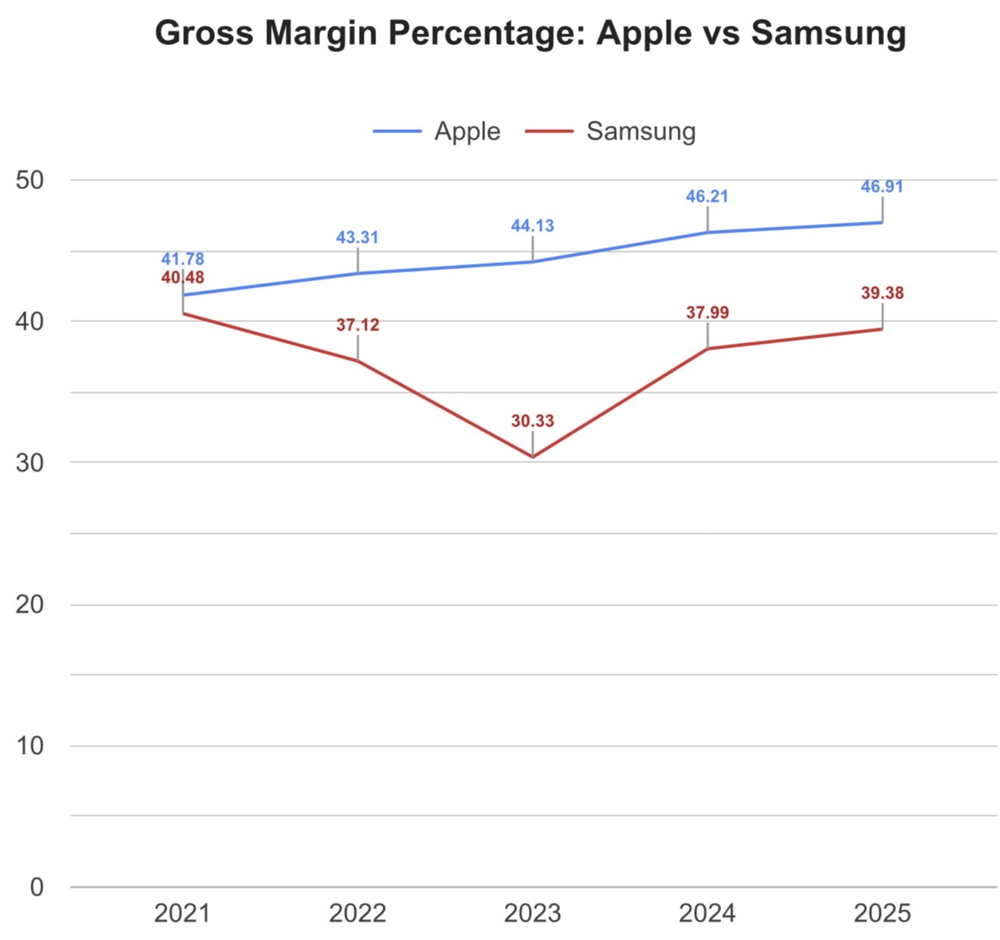
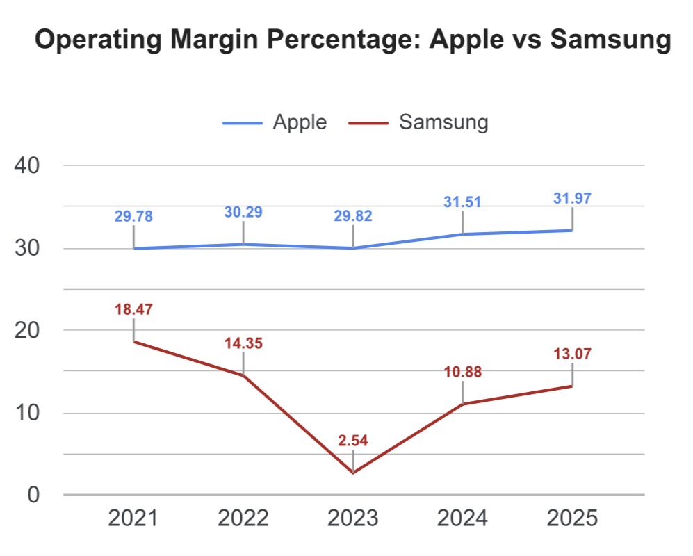

# Apple vs Samsung - Margin Structure & Revenue Mix Comparison (FY2021-2025)

## Does Apple’s Services-Driven Revenue Mix Create a Structural Gross Margin Advantage over Samsung’s Hardware-Driven Business Model ?

[](https://www.postgresql.org)
[](https://neon.tech)
[](https://www.postgresql.org)
[](https://lookerstudio.google.com)
[](https://www.microsoft.com/excel)

## Project Overview

This project benchmarks Apple Inc.’s margin structure against Samsung Electronics — its closest direct hardware competitor — across FY2021-2025, using PostgreSQL for data modeling and analysis and Looker Studio for visualization. The analysis tests whether Apple’s Services-driven margin advantage, established in Parts 1 and 2 of this series, holds up under direct external competitive benchmarking.

## Project Series Context

**This is part 3 of a three-part Apple Inc. financial analysis series.**

Part 1 - Services-Driven Revenue & Margin Analysis established that Apple’s blended gross margin expansion from 41.78% to 46.91% (FY2021-2025) is attributable to Services mix shift. Services grew at a 12.39% 4-year CAGR while Products revenue plateaud.

Part 2 - Geographic Revenue Exposure & China Risk Analysis stress-tested that thesis against Apple’s largest single revenue-concentration risk. It found the Services thesis remains resilient even under a severe Greater China revenue shock.

Part 3 (this project) extends the stress-test externally: how does Apple’s margin structure compare to a hardware-dependent peer with no equivalent Services business ? Samsung Electronics - Apple’s closest direct hardware rival.

___

## Business Question

Does Apple’s Services-Driven revenue mix create a structural gross margin advantage over Samsung’s hardware-dependent business model or does Apple’s apparent superiority simply reflect where each company happens to sit in the commodity pricing at this moment in time ?

This resolves into a testable framing: Is Apple’s margin advantage **structural** - driven by a deliberate, sustainable shift toward high-margin Services - or **cyclical**, subject to the same commodity price swings that govern Samsung’s hardware and Semiconductor business ?

___



**[View live interactive dashboard →](https://datastudio.google.com/reporting/86169817-2172-4889-a0ae-87c98c400421)**

___

## Key Findings

| Metric | Apple | Samsung |
| --- | --- | --- |
| Gross margin FY2021 | 41.78% | 40.48% |
| Gross margin FY2025 | 46.91% | 39.38% |
| Gross margin trend | Improved every year | Down 10pts, partial recovery |
| Operating margin FY2021 | 29.78% | 18.47% |
| Operating margin FY2023 (trough) | 29.82% | 2.54% |
| Largest single-year margin swing (company level) | 1.69 points | 11.81 points |
| Largest single-year margin swing (segment level) | 3.05 points (Services) | **46.56 points (Semiconductors)** |
| Services/high-margin segment share of revenue | 18.7% → 26.2% | No structural mix shift |

___

## A Closer Look: Why Apple’s Margin Improvement Isn’t Just Mix Shift

Apple’s margin improvement isn’t just mix shift — it’s **two compounding effects moving in the same direction simultaneously**:

- **Mix effect:** Services revenue share grew from 18.7% to 26.2% of total revenue
- **Segment effect:** Services’ *own* gross margin also expanded, from 69.73% to 75.41%

Products margin, by contrast, stayed roughly flat (35.35% → 36.77%). The blended margin improvement is therefore not simply “more revenue flowing to an already-profitable segment” — Services itself became structurally more profitable over the period, likely reflecting subscription scale and higher-margin service lines maturing.

## The Counterintuitive Result

In FY2021 Samsung’s Semiconductors division posted a **30.60% operating margin** - comfortably higher than Apple’s company-wide operating margin of 29.78% that same year. By FY2023, that same division had swung to **-22.37%** a loss making business, while Apple’s margin never dropped below 29.78% across the entire five-year period.

The company most people assume is more volatile, “cheaper” hardware manufacturer had, for one brief moment, a single division outperforming Apple’s entire operating margin. Two years later that same division was underwater. This is the clearest evidence in the dataset that Samsung’s margin outcomes are not a matter of operational discipline - they are set almost entirely by where the global semiconductor pricing cycle happens to be standing.

## Interpretation

**Apple (Structural Stability):** Gross margins show consistent, high-floor stability over the study period. Apple’s pricing power and Services ecosystem appear to insulate profitability from broader macroeconomic headwinds - likely reinforced by strategic moves like custom silicon, though this dataset measures margin outcomes rather than their specific internal drivers.

**Samsung (Cyclical Volatility):** Margin direction fluctuates violently - driven primarily by global semiconductor supply dynamics rather than internal operational shift.

**Conclusion:** Apple’s margin advantage is structural and ecosystem-driven. Samsung’s margin outcomes remain fundamentally hostage to the global memory cycle, where external commodity spot pricing heavily outweighs internal management levers.

___

## Data Sources

| Source | Usage |
| --- | --- |
| Apple Form 10-K (FY2021–2025) | Company totals, Products/Services segment revenue & gross profit |
| Samsung Consolidated Statements of Profit or Loss (audited, FY2021–2025) | Company-level totals (revenue, cost of sales, gross/operating/net profit) |
| Samsung Quarterly Earnings Presentations (4Q, FY2021–2025) | Segment-level revenue and operating profit (DX/DS/SDC/Harman) |

All figures sourced from audited filings or official investor relations materials. Raw source PDFs and processed Excel extraction files are available in [`/data/`](data/).

___

## Methodology

### Two-Layer Analytical Structure

Apple and Samsung disclose different segment-level profitability metrics, so a single unified comparison isn’t possible at that level:

| Metric | Apple (segment level) | Samsung (segment level) |
| --- | --- | --- |
| Revenue | ✅ | ✅ |
| Gross Profit | ✅ | ❌ not disclosed |
| Operating Profit | ❌ not allocated | ✅ |

Apple’s Products/Services split is a revenue disaggregation under US GAAP, not a formal reportable segment — R&D and SG&A are managed at the corporate level. Samsung discloses full segment operating profit but not segment-level cost of sales.

Given no common segment-level profitability metric exists, the analysis is split into two layers:

- **Layer 1 — Revenue Mix** (segment level): the one metric both companies disclose consistently
- **Layer 2 — Margin Outcomes** (company level): full gross/operating/net margin comparison, where both companies disclose everything

### FX Methodology

Samsung’s KRW figures are converted to USD using **each fiscal year’s own average exchange rate**, taken from that year’s own primary-reporting column — never from a prior-year comparative appearing in a later statement. This was a deliberate fix after discovering that Samsung re-translates prior-year comparatives using the *current* year’s closing rate, which can materially distort historical USD figures depending on which statement year they’re pulled from.

### Accounting Standards

Samsung reports under K-IFRS, Apple under US GAAP. Framework differences (e.g. R&D capitalization treatment) were reviewed but no subjective adjustments were made, to preserve analytical transparency.

___

## Database Schema

**Provider:** Neon (Serverless PostgreSQL)

### Tables

**companies**

| Column | Type | Description |
| --- | --- | --- |
| company_id | SERIAL PK | Unique company identifier |
| company_name | VARCHAR(50) | Apple or Samsung |
| reporting_currency | VARCHAR(10) | USD or KRW |
| fiscal_year_end | VARCHAR(20) | September or December |

**segments**

| Column | Type | Description |
| --- | --- | --- |
| segment_id | SERIAL PK | Unique segment identifier |
| company_id | INT FK | References companies |
| segment_label | VARCHAR(50) | Original filing label (e.g. DX, DS) |
| segment_name | VARCHAR(50) | Standardised name |

**company_financials**

| Column | Type | Description |
| --- | --- | --- |
| fiscal_year | INT | 2021–2025 |
| revenue_usd_millions | NUMERIC(12,2) | Total revenue |
| gross_profit_usd_millions | NUMERIC(12,2) | Gross profit |
| op_profit_usd_millions | NUMERIC(12,2) | Operating profit |
| net_profit_usd_millions | NUMERIC(12,2) | Net profit |

**segment_revenue**

| Column | Type | Description |
| --- | --- | --- |
| fiscal_year | INT | 2021–2025 |
| revenue_usd_millions | NUMERIC(12,2) | Segment revenue |
| gross_profit_usd_millions | NUMERIC(12,2) | Apple only |
| op_profit_usd_millions | NUMERIC(12,2) | Samsung only |

### Views

- `v_company_margins` — pre-calculated gross/operating/net margin % by company/year
- `v_segment_mix` — pre-calculated revenue mix % by segment/company/year

___

## SQL Analysis

### Query 01 — Apple Revenue Mix by Year

**File:** `queries/01_revenue_mix_apple.sql`

Window function calculating each segment’s percentage share of total revenue per fiscal year using `SUM() OVER (PARTITION BY fiscal_year)`.

**Result:**

| Segment | FY2021 | FY2022 | FY2023 | FY2024 | FY2025 |
| --- | --- | --- | --- | --- | --- |
| Products | 81.3% | 80.2% | 77.8% | 75.4% | 73.8% |
| Services | 18.7% | 19.8% | 22.2% | 24.6% | 26.2% |

Services Revenue constantly rising over the five year period.



___

### Query 02 — Samsung Revenue Mix by Year

**File:** `queries/02_revenue_mix_samsung.sql`

Same window function pattern applied to Samsung’s four business segments.

**Result:**

| Segment | FY2021 | FY2022 | FY2023 | FY2024 | FY2025 |
| --- | --- | --- | --- | --- | --- |
| Device Experience | 54.8% | 55.5% | 60.3% | 53.1% | 51.7% |
| Semiconductors | 31.4% | 30.0% | 23.6% | 33.7% | 35.8% |
| Display | 10.5% | 10.5% | 11.0% | 8.9% | 8.2% |
| Consumer & Auto | 3.3% | 4.0% | 5.1% | 4.3% | 4.3% |



___

### Query 03 — Company-Level Margins

**File:** `queries/03_company_margins.sql`

Core comparison table joining `company_financials` to `companies`, calculating gross, operating, and net margin percentage for both companies across all five years.

**Result:**

| Company | FY2021 | FY2022 | FY2023 | FY2024 | FY2025 |
| --- | --- | --- | --- | --- | --- |
| Apple (Gross Margin) | 41.78% | 43.31% | 44.13% | 46.21% | 46.91% |
| Samsung (Gross Margin) | 40.48% | 37.12% | 30.33% | 37.99% | 39.38% |
| Apple (Operating Margin) | 29.78% | 30.29% | 29.82% | 31.51% | 31.97% |
| Samsung (Operating Margin) | 18.47% | 14.35% | 2.54% | 10.88% | 13.07% |





___

### Query 04 — Year-over-Year Margin Deltas

**File:** `queries/04_margin_yoy_deltas.sql`

`LAG()` window function partitioned by company, ordered by fiscal year, quantifying the magnitude of margin swings period-over-period.

**Result:**

| Company | Metric | Largest YoY Swing |
| --- | --- | --- |
| Apple | Gross Margin | +2.08 points (FY2024) |
| Samsung | Gross Margin | -6.79 points (FY2023) |
| Apple | Operating Margin | +1.69 points (FY2024) |
| Samsung | Operating Margin | -11.81 points (FY2023) |

___

### Query 05 — Apple Segment Margin Trend

**File:** `queries/05_apple_segment_margins.sql`

Decomposes blended margin improvement into mix effect vs. segment margin effect.

**Result:**

| Segment | FY2021 Margin | FY2025 Margin | Change |
| --- | --- | --- | --- |
| Products | 35.35% | 36.77% | +1.42pp |
| Services | 69.73% | 75.41% | +5.68pp |

**Finding:** Services margin itself expanded, not just its revenue share — a compounding effect on top of mix shift.

___

### Query 06 — Samsung Segment Margin Trend

**File:** `queries/06_samsung_segment_margins.sql`

Segment-level operating margin trend by division.

**Result:**

| Segment | FY2021 Margin | FY2023 Margin | FY2025 Margin |
| --- | --- | --- | --- |
| Device Experience | 10.46% | 8.47% | 6.86% |
| Semiconductors | 30.60% | -22.37% | 19.14% |
| Display | 14.06% | 18.06% | 13.78% |
| Consumer & Auto | 5.98% | 8.33% | 9.49% |

**Finding:** Semiconductors swung from +30.60% to -22.37% margin (2021–2023), the single largest driver of Samsung’s company-level margin collapse.

___

```
apple-vs-samsung-margin-analysis/
├── data/
│   ├── inserts/
│   │   ├── 02_insert_companies.sql
│   │   ├── 03_insert_segments.sql
│   │   ├── 04_insert_company_financials.sql
│   │   └── 05_insert_segment_revenue.sql
│   ├── processed/
│   │   ├── Apple_Financial_Data.xlsx
│   │   └── Samsung_Financial_Data.xlsx
│   └── raw/
│       ├── apple/
│       │   ├── _10-K-2021-As-Filed.pdf
│       │   ├── _10-K-2022-As-Filed.pdf
│       │   ├── _10-K-2023-As-Filed.pdf
│       │   ├── _10-K-2024-As-Filed.pdf
│       │   └── _10-K-2025-As-Filed.pdf
│       └── samsung/
│           ├── audited_statements/
│           │   ├── 2021_con_quarter04_soi.pdf
│           │   ├── 2022_con_quarter04_soi.pdf
│           │   ├── 2023_con_quarter04_soi.pdf
│           │   ├── 2024_con_quarter04_soi.pdf
│           │   └── 2025_con_quarter04_soi.pdf
│           └── earnings_presentations/
│               ├── 2021_4Q_conference_eng.pdf
│               ├── 2022_4Q_conference_eng.pdf
│               ├── 2023_4Q_conference_eng_01.pdf
│               ├── 2024_4Q_conference_eng.pdf
│               └── 2025_4Q_conference_eng.pdf
├── queries/
│   ├── 01_revenue_mix_apple.sql
│   ├── 02_revenue_mix_samsung.sql
│   ├── 03_company_margins.sql
│   ├── 04_margin_yoy_deltas.sql
│   ├── 05_apple_segment_margins.sql
│   └── 06_samsung_segment_margins.sql
├── schema/
│   ├── 01_create_tables.sql
│   ├── 02_create_views.sql
│   └── 03_create_segment_revenue_mix_view.sql
├── visualizations/
│   ├── 01_dashboard_overview.png
│   ├── 02_gross_margin_comparison.png
│   ├── 03_operating_margin_comparison.png
│   ├── 04_apple_revenue_mix.png
│   └── 05_samsung_revenue_mix.png
├── .gitignore
├── LICENSE
└── README.md

```
___

## Skills Demonstrated

- Comparative financial statement analysis across two accounting standards (US GAAP / K-IFRS)
- Multi-source data reconciliation and FX methodology correction
- Relational database design (PostgreSQL) with foreign key integrity
- SQL window functions and CTEs for time-series and cross-sectional analysis
- Margin decomposition (mix effect vs. segment effect)
- Business intelligence dashboarding
- Data storytelling and disclosure-limitation transparency

## Tools Used

| Tool | Purpose |
| --- | --- |
| PostgreSQL (Neon) | Serverless database, schema design, SQL analysis |
| Excel | Data extraction and verification from source filings |
| Looker Studio | Dashboard visualization |
| SEC EDGAR / Samsung IR | Primary data sources |
| GitHub | Version control and portfolio presentation |

## Key SQL Techniques

- `SUM() OVER (PARTITION BY)` — revenue mix share calculation per year
- `LAG() OVER (PARTITION BY ... ORDER BY ...)` — year-over-year margin delta calculation
- CTEs — segment margin decomposition queries
- Views — pre-aggregated data sources for BI tool connectivity

___

## Conclusion

Apple’s gross margin improved in every year of the FY2021–2025 study period, rising from 41.78% to 46.91% with no single-year decline. Samsung’s gross margin, over the same period, swung by as much as 10 points trough-to-peak and has not yet recovered to its 2021 level. At the segment level, the gap is even starker: Apple’s largest single-year segment margin swing was 3.05 points (Services), while Samsung’s Semiconductors division swung by 46.56 points — a 15x difference in volatility.

This is not a story of Apple being simply “better run.” It reflects a structural difference in each company’s revenue mix. Apple has spent five years deliberately shifting revenue toward Services, a segment whose own margin also independently expanded. Samsung’s revenue mix, by contrast, has no equivalent structural lever — its largest segment (Semiconductors) is a global commodity business, and its margin outcomes are set by a pricing cycle Samsung does not control.

The conclusion validates the thesis established across all three parts of this series: Apple’s margin advantage is structural and appears durable even under direct competitive benchmarking against a company with comparable scale, R&D intensity, and hardware manufacturing capability, but no equivalent high-margin Services business.

___

## Limitations

- Segment-level profitability comparison is constrained by differing disclosure practices (Apple: gross profit; Samsung: operating profit) — no common segment-level margin metric exists across both companies
- K-IFRS vs. US GAAP differences (e.g. R&D capitalization) were reviewed but not adjusted for, per the transparency-over-precision principle stated in Methodology
- Samsung’s fiscal year (calendar year) does not perfectly align with Apple’s fiscal year (ending late September) — a small but real comparability limitation
- Analysis based on reported financials only; does not incorporate operational, supply chain, or currency-hedging detail beyond what’s disclosed

___

## Future Improvements

- Extend comparison to a third hardware competitor (e.g. Xiaomi) for broader benchmarking
- Incorporate quarterly granularity to isolate seasonal effects from cyclical ones
- Automate FX rate sourcing via API rather than manual extraction from filings
- Build a live-updating pipeline connecting new quarterly filings directly to the Neon database

## Author

**Troy Sithole**
Aspiring Financial Analyst | PostgreSQL · SQL · Excel · Looker Studio · SEC EDGAR

[LinkedIn](https://www.linkedin.com/in/troysithole) · [GitHub](https://github.com/troy-sithole) · [Part 1 — Services-Driven Revenue & Margin Analysis](https://github.com/troy-sithole/apple-financial-analysis) · [Part 2 — Geographic Revenue Exposure & China Risk](https://github.com/troy-sithole/apple-geographic-analysis)
